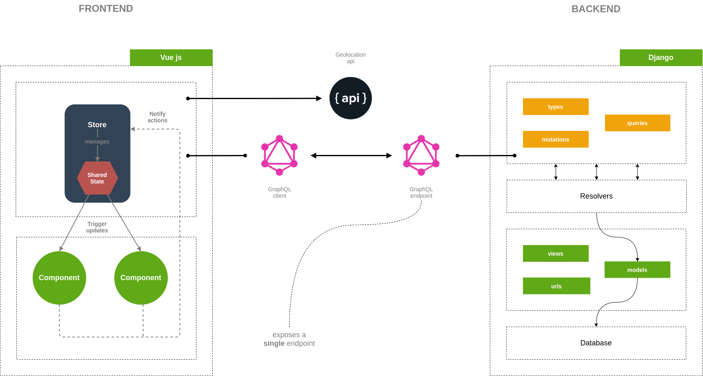
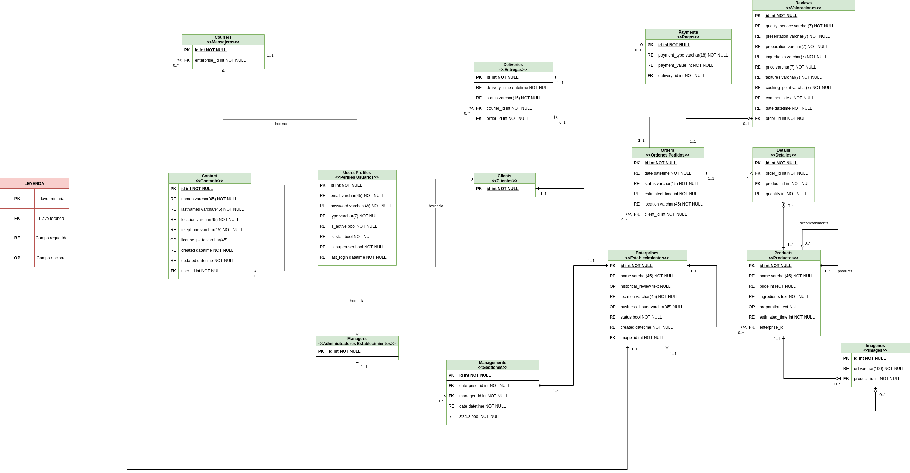

# Gastronomic Backend

Aplicación de domicilios gastronómicos para la materia Proyecto 1 de la Universidad del Cauca.

Hoy en día los domicilios de gastronomía se han convertido en una necesidad para el mundo, debido a situaciones como: la pandemia del COVID-19, largas jornadas laborales o de estudio, el cuidado de los niños, entre otras. Esto ha generado que las personas no tengan tiempo para llevar a cabo las actividades culinarias, ocasionado en buena parte, que éstas sean cedidas o endosadas a otras personas, restaurantes, etc. Situación que podría afianzarse aún más en el futuro por la crisis sanitaria y las tendencias profesionales.

---

## Tecnologías

- [Django](https://www.djangoproject.com/)
- [GraphQl](https://graphene-python.org/)

---

## Extensiones para Visual Studio Code

- [Python](https://marketplace.visualstudio.com/items?itemName=ms-python.python)
- [Pylance](https://marketplace.visualstudio.com/items?itemName=ms-python.vscode-pylance)
- [Editor Config](https://marketplace.visualstudio.com/items?itemName=EditorConfig.EditorConfig)
- [Indent Rainbow](https://marketplace.visualstudio.com/items?itemName=oderwat.indent-rainbow)
- [Better Comments](https://marketplace.visualstudio.com/items?itemName=aaron-bond.better-comments)

---

## Pasos para ejecutar la aplicación

1. Se recomienda utilizar **Python 3.6** o superior
2. Se recomienda utilizar [entornos virtuales](https://docs.python.org/es/3/tutorial/venv.html)
3. Instalar las dependencias contenidas en **requirements.txt** usando el comando `pip install -r requirements.txt`
4. Ejecutar el archivo **manage.py** con `python manage.py makemigrations`
5. Ejecutar el archivo **manage.py** con `python manage.py migrate`
6. Ejecutar el archivo **manage.py** con `python manage.py runserver`
7. Abrir el navegador e ir a la dirección <http://localhost:8000/> or <http://127.0.0.1:8000/>

---

## Diagramas

Diagrama realizado con la aplicación **Drawio**
- [Online](https://app.diagrams.net/)
- [Desktop](https://www.diagrams.net/)

### Arquitectura


### Base de Datos


---

## API GraphQL

Para iniciar la interfaz gráfica de Graph*i*QL, ir a la dirección <http://localhost:8000/graphql> o <http://127.0.0.1:8000/graphql>

### Queries

```
query consultar {
  allEnterprises {
    edges {
      node {
        id
        name
        location
        products {
          edges {
            node {
              id
              name
            }
          }
        }
      }
    }
  }
}
```

### Mutations

#### Crear establecimiento
```
mutation crear {
  createEnterprise(input: {name: "nombre del establecimiento", location: "dirección"}) {
    enterprise {
      id
      name
      location
    }
  }
}
```

#### Actualizar establecimiento
```
mutation actualizar {
  updateEnterprise(input: {id: "RW50ZXJwcmlzZU5vZGU6Mg==", name: "nuevo nombre"}) {
    enterprise {
      id
      name
    }
  }
}
```

#### Eliminar establecimiento
```
mutation eliminar {
  deleteEnterprise(input: "RW50ZXJwcmlzZU5vZGU6Mg==") {
    enterprise {
      id
      name
      location
    }
  }
}
```
